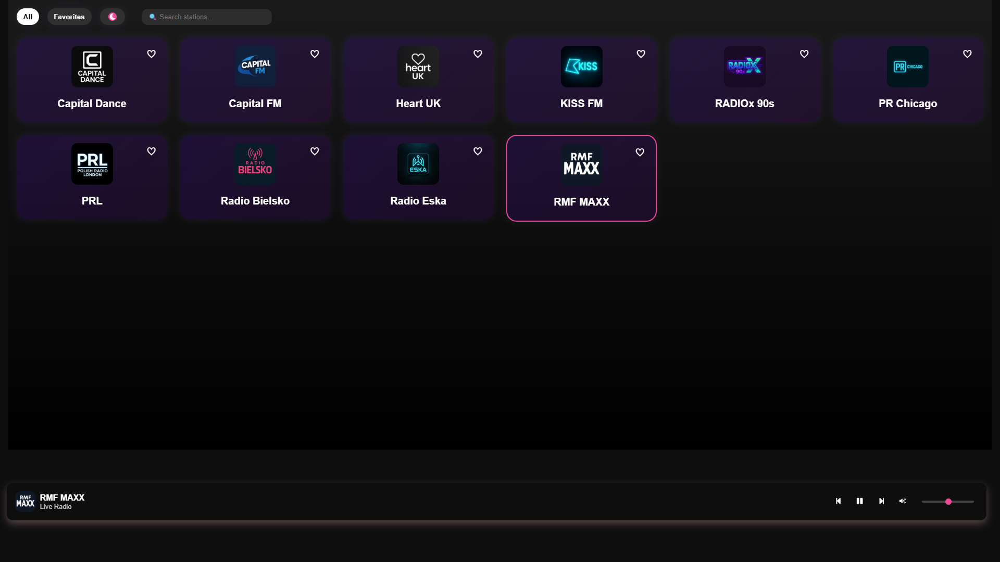
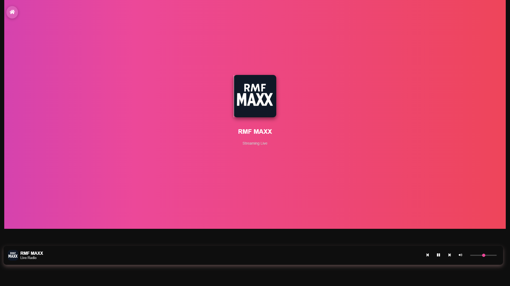
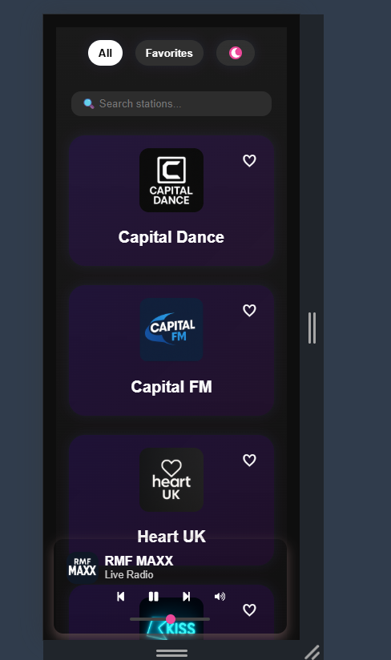
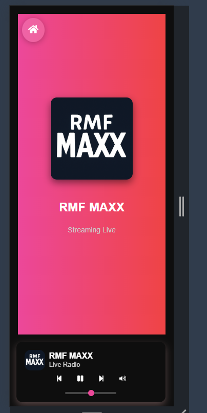

# 🌍 World Radio App

A modern Progressive Web App (PWA) that streams live internet radio stations from around the world. Built with **React**, **Tailwind CSS**, and **Context API** — optimized for desktop, mobile, and car media systems. 

Supports:
- ✅ Live streaming with station switching
- ✅ Favorites (saved locally)
- ✅ Search and category filtering
- ✅ Responsive mobile/desktop layout
- ✅ Installable as a PWA (Android, desktop)
- ✅ Deployable to Google Play Store via Trusted Web Activity (TWA)

---

## 🔗 Live Demo

🌐 [World Radio App](https://worldradioapp.netlify.app)

---

## 📦 Folder Structure

```
world-radio-app/
├── public/
│   ├── icons/                     # App icons for PWA (512x512, etc.)
│   ├── manifest.json              # PWA manifest
│   ├── index.html
│   ├── offline.html               # In case of error official website 
│   └── service-worker.js
│
├── src/
│   ├── assets/                   # Static assets (images, logos)
│   │   ├── logos/                # radio logos
│   │   |   └── screenshots/
│
│   ├── components/               # Reusable components
│   │   ├── Layout/
│   │   │   ├── SoundBar.js
│   │   │   └── PageTransition.js
│
│   ├── context/                  # React Contexts
│   │   ├── AudioContext.js
│   │   ├── FavoritesContext.js
│   │   └── ThemeContext.js
│
│   ├── data/                     # Static data (e.g. station list)
│   │   └── stations.js
│
│   ├── pages/                    # Page components (routed views)
│   │   ├── Home.js
│   │   └── NowPlaying.js
│
│   ├── Globalstyle.js            # Global styled-components
│   ├── darkTheme.js              # Theme config (dark)
│   ├── lightTheme.js             # Theme config (light)
│   ├── App.js                    # Main component with routes
│   ├── index.js                  # Entry point (with Providers)
│   ├── service-worker.js         # Custom service worker (optional)
│   └── serviceWorkerRegistration.js
│
├── package-lock.json
├── package.json
├── .gitignore
└── README.md

```

---

## 🚀 Getting Started

```bash
# Clone the repo
git clone https://github.com/Silentmaster86/world-radio-app.git
cd world-radio-app

# Install dependencies
npm install
npm install react-scripts --save-dev
npm install react-icons
npm install styled-components
npm i --save-dev @types/react

# Run the development server
npm start
```

---

## 🛠 Features

- 🎵 Stream internet radio stations
- 🔁 Switch stations (Next/Previous)
- 🔍 Search functionality
- ❤️ Add/remove favorite stations
- 📱 Mobile & car media-friendly
- 🧭 Media Session API support
- 📲 Add to Home Screen (PWA)
- 🧱 TWA-ready for Google Play

---

## 📱 PWA Support

Includes:
- `manifest.json`
- `service-worker.js`
- Media Session API for metadata + controls

### To test locally:
```bash
npm run build
npx serve -s build
```

Open [http://localhost:3000](http://localhost:3000)  
Use DevTools → Application tab → Check Manifest and Service Worker

---

## 📤 Google Play Publishing (TWA)

1. Go to [https://www.pwabuilder.com](https://www.pwabuilder.com)
2. Enter `https://worldradioapp.netlify.app` as the app URL
3. Choose **Android (TWA)** and download the ZIP
4. Open in Android Studio, customize, and test
5. Upload `.aab` to Google Play Console and publish

---

## 📸 Screenshots

### Home Screen (Desktop)


### Now Playing View (Desktop)


### Home Screen (Mobile)


### Now Playing View (Mobile)


---

## 📃 License

This project is licensed under the MIT License.

---

## 🙌 Credits

Built by Przemyslaw Pietkun (https://github.com/Silentmaster86)  
Inspired by the simplicity of music and power of the web 🌐
